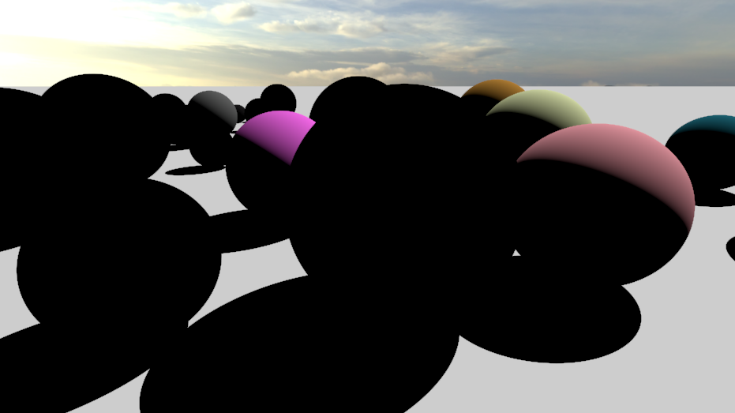
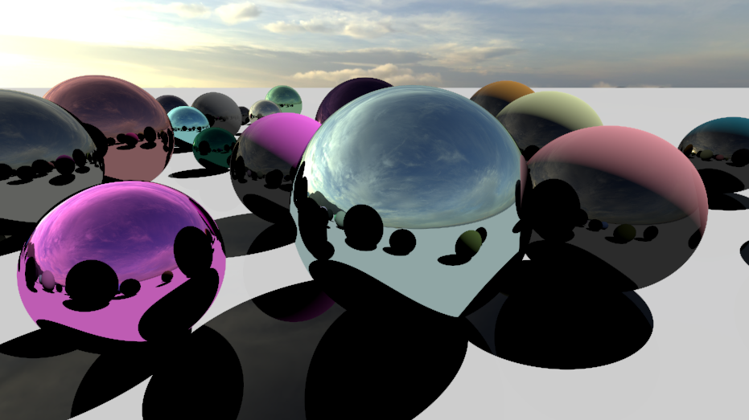
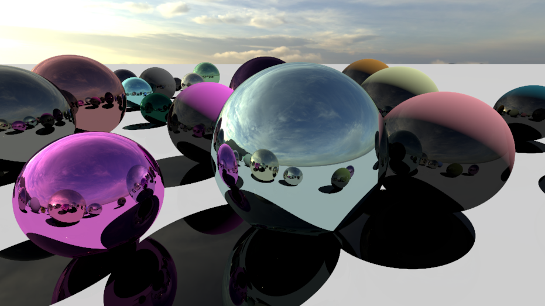
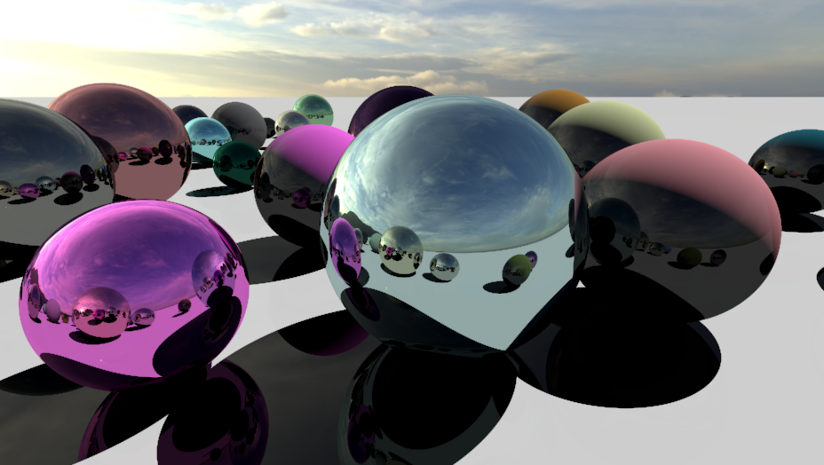

# Ray tracing basics

Based on the article *[GPU Ray Tracing in Unity – Part 1](http://blog.three-eyed-games.com/2018/05/03/gpu-ray-tracing-in-unity-part-1/)* by David Kuri.

This project is an implementation of real-time ray tracing in Unity using compute shaders. It consists of a basic development of rays cast from the camera to simulate reflection, although the article does go a lot further than this.

---

## Gallery

| 1 bounce  | 2 bounces |
|-----------|-----------|
|  |  |
| 4 bounces  | 8 bounces |
|  |  |
